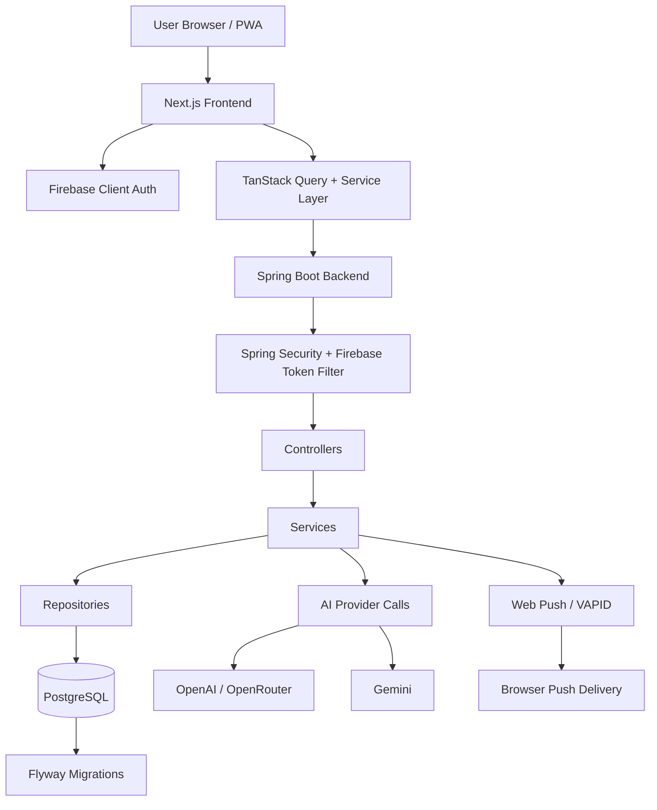
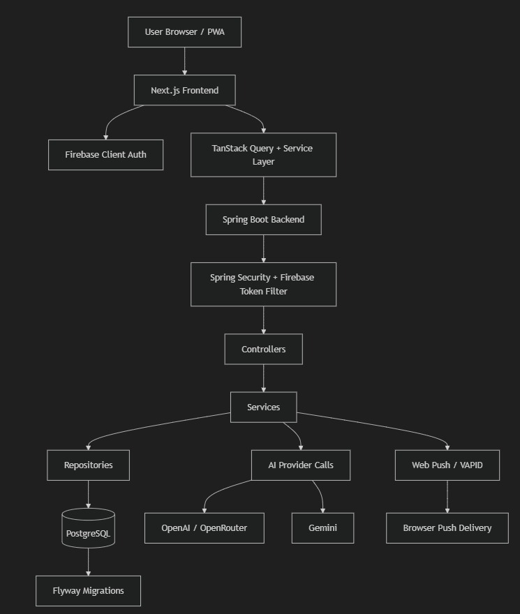

# LifeOS-v3 Architecture Summary

## System Summary

LifeOS v3 is a full-stack personal life management platform with a Next.js PWA frontend and a Spring Boot REST backend backed by PostgreSQL. Authentication is handled with Firebase ID tokens verified on the backend. Most feature data is user-scoped and persisted in relational tables, with JSONB used for flexible domains such as notes, habits, preferences, and workout state.

## High-Level Architecture

## Major Layers

### Frontend

- Framework: Next.js 15 App Router.
- UI shell: `frontend/src/components/layout/AppLayout.tsx`
- Data fetching: `frontend/src/providers/query-provider.tsx`
- API client: `frontend/src/lib/api-client.ts`
- Domain services: `frontend/src/services/`
- Auth state: `frontend/src/hooks/use-auth.tsx`
- PWA behavior: `frontend/next.config.mjs`, `frontend/src/worker/index.ts`

### Backend

- Entry point: `backend/src/main/java/com/lifos/backend/LifeOsBackendApplication.java`
- Security config: `backend/src/main/java/com/lifos/backend/config/SecurityConfig.java`
- Firebase filter: `backend/src/main/java/com/lifos/backend/security/FirebaseAuthenticationFilter.java`
- Controllers: `backend/src/main/java/com/lifos/backend/controller/`
- Services: `backend/src/main/java/com/lifos/backend/service/`
- Repositories: `backend/src/main/java/com/lifos/backend/repository/`
- Entities: `backend/src/main/java/com/lifos/backend/entity/`
- DTOs: `backend/src/main/java/com/lifos/backend/dto/`

### Database

- PostgreSQL is the primary persistence layer.
- Schema source of truth: `backend/src/main/resources/db/migration/`
- Runtime validation: `backend/src/main/resources/application.yaml`
- pgvector enabled for future vector retrieval work.

## Request Flow

1. User signs in with Google through Firebase on the frontend.
2. Frontend obtains a Firebase ID token.
3. API client sends `Authorization: Bearer <token>` to the Spring backend.
4. `FirebaseAuthenticationFilter` verifies the token with Firebase Admin SDK.
5. Spring Security populates the `SecurityContext`.
6. Controllers resolve current user UID through `SecurityUtils`.
7. Services apply business logic and call repositories.
8. Repositories persist to PostgreSQL tables managed by Flyway.

## Feature Domains

- Productivity: todos, planner, habits, goals, notes.
- Personal finance: transactions and budgets.
- Security: credential vault with encrypted fields.
- Fitness: workout split, cycle config, protein intake, food log, completions.
- Engagement: notifications and Web Push.
- AI: admin-configurable chat provider integration.
- Admin: system settings, announcements, AI config, user stats, about-page content.

## Data Modeling Strategy

### Relational modeling

- Used for users, todos, transactions, notifications, goals, planner items, push subscriptions, and admin tables.

### JSONB modeling

- Used where structure is flexible or nested:
  - note content
  - habit completions
  - preferences
  - workout split
  - gym completions
  - custom foods
  - system settings and AI config payloads

## Security Model

- Firebase identity is the source of authenticated user identity.
- Backend verifies all protected API requests.
- Admin authorization uses role mapping from the `users` table.
- Credential secrets are encrypted using AES-256-GCM before database persistence.
- CORS is explicitly configured for local frontend origins.

## External Integrations

- Firebase Auth and Firebase Admin SDK.
- OpenAI-compatible AI APIs and Gemini.
- Web Push via VAPID.

## Operational Notes

- Backend is containerized and can run alongside PostgreSQL via Docker Compose.
- Frontend supports mock services for development without a backend.
- No CI/CD workflow is present in the repository.
- AI groundwork for streaming, async execution, and pgvector exists, but current implemented chat remains centered on `POST /api/ai/chat`.

## Notable Architectural Strengths

- Clear backend layering and DTO boundaries.
- Real authentication and authorization instead of demo-only auth state.
- Good separation between frontend domain services and transport concerns.
- Offline-capable frontend with service worker caching and push handling.
- Shared notification pipeline combining persistence and push delivery.

## Architectural Caveats

- Frontend docs contain some drift relative to the current Spring backend architecture.
- A few Next.js API route handlers are placeholders and should not be treated as the system-of-record backend implementation.
- The public About page is currently static even though the backend supports admin-managed about content.